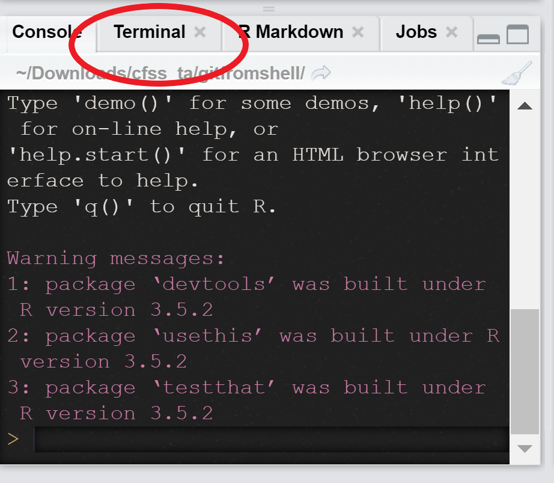

```{r setup, include=FALSE}
knitr::opts_chunk$set(echo = TRUE)
```

# Using Git From Shell 

Oh no I cloned from the master instead of my fork! 


# Using Git From Shell 

1. Get to your working directory (either ```cd``` in shell or ```setwd()``` in R)
2. ```git remote -v``` lists existing remotes 
3. ```git more set-url origin``` + the URL will let you change the remote 

# ```reprex()``` Example 

# What You Should Be Committing 

# ```here()``` Review 

# Things That'll Get You Excellents on This Assignment 