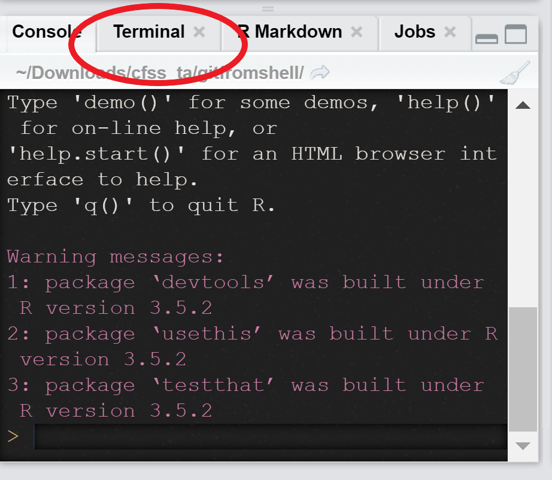

```{r setup, include=FALSE}
knitr::opts_chunk$set(echo = TRUE)
```

# Using Git From Shell 

Oh no I cloned from the master instead of my fork! 



# Using Git From Shell 

1. Get to your working directory 
2. ```git remote -v``` lists existing remotes 
3. ```git more set-url origin``` + the URL will let you change the remote 

# ```reprex()``` Example 

1. Copy the relevant code onto your clipboard 
2. Run ```reprex::reprex(si=TRUE)```
3. Rendered reprex should pop up in your viewer and be copied to your clipboard. 

# ```here()``` Review 

1. As long as your file paths don't have your name in them, you should be fine 
2. ```here()``` makes sure your project is portable (you can specify subdirectories with commas)
```{r, eval=FALSE}
library(readr)
library(here)

read_csv(here("data", "raw_foofy_data.csv"))
read_csv("data/raw_foofy_data.csv")

```


# Things That'll Get You Excellents on This Assignment 
- Using a completely unique dataset you had to do some cleaning on yourself 
- Code Externalization
- Functions/YAML 